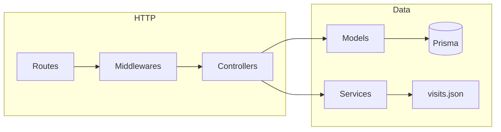

# Architecture — DMU Web

Onboarding guide: **layers**, **folders**, and **request/data flow**. Code comments stay minimal; this file is the map.

## Stack

| Layer | Technology |
|-------|------------|
| UI | React 18, Vite 5, React Router 6 |
| API | Express 4, express-session |
| Persistence | Prisma 5, PostgreSQL |
| Uploads | busboy → `uploads/images`, `uploads/videos` |
| Analytics (optional) | `backend/data/visits.json` |

## Repository layout

```
DMUWeb/
├── backend/
│   ├── server.js              # connectDatabase() + listen
│   ├── config/index.js        # Env, paths (no business rules)
│   ├── db/prisma.js           # Shared PrismaClient instance
│   ├── src/
│   │   ├── app.js             # buildApp() — middleware + routes
│   │   ├── routes/            # HTTP paths → controllers (no DB here)
│   │   ├── controllers/       # req/res, status codes; call models/services
│   │   ├── models/            # Prisma access — article “repository”
│   │   ├── services/          # Reusable non-HTTP logic (e.g. visits)
│   │   ├── middlewares/       # auth, multipart, error handler
│   │   └── utils/             # Pure helpers (layout merge, weeks, excerpt)
│   └── data/visits.json       # Visit log (file-backed)
├── database/prisma/schema.prisma
├── frontend/src/
│   ├── pages/, layouts/, components/, api/
└── docs/                      # README, architecture
```

## Request flow (API)



**Rules**

- **Routes** — wire paths and middleware; delegate to controllers. No Prisma/SQL.
- **Controllers** — parse input, call `post.model` or `visits.service`, send JSON.
- **Models** — `database.js` (connect + export `prisma`), `post.model.js` (articles + layout + media + filesystem cleanup for uploads).
- **Middlewares** — `requireAdmin`, `uploadPostFiles`, `errorHandler` (last).

## Article data model (Prisma)

- **`articles`** — title, content, excerpt, status, timestamps.
- **`content_layout`** — blocks (text / image / video), `position`, optional `metadata` (JSON, e.g. `alt`).
- **`media`** + **`content_media`** — normalized media rows linked to blocks; delete/update paths in `post.model.js` also remove files under `uploads/` when appropriate.

## Frontend

- **Routes** — `frontend/src/App.jsx`: `/`, `/news/:id`, `/admin/*` (nested under `AdminShell`).
- **API clients** — `api/client.js`, `api/articleUpload.js`; admin calls use `credentials: "include"`.

## Extension points

- Schema changes: edit `database/prisma/schema.prisma`, then `npm run db:migrate` (tao/ap migration). `db:push` chi dung thu nhanh, khong luu lich su.
- **`admins` table** — seed via `npm run db:seed`; login verifies bcrypt; env fallback if no row exists.
- Large `post.model.js` could be split into repository + mappers if the team grows.

See also: [README.md](README.md).
